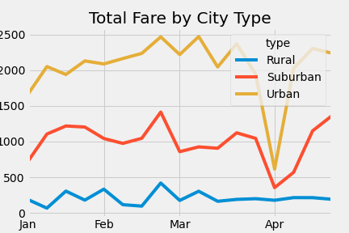

# Pyber Data Analysis with MatPlotLib

## Overview of Pyber Data 
The purpose of this project is to help Pyber, a ride sharing company, determine
which areas need more drivers and how much the average cost should be per ride. 
The total number of drivers per area type was calculated as well total number of
rides given per area. Average ride fares were calculated per area type by summing
up the cost for each ride and diviving that number by the total number of rides per
area. This data was then visually displayed in a line graph to identify any trends
or areas of improvement.

## Results

### Urban Areas
Urban areas have the highest number of drivers and total rides compared to suburban areas
and Rural Areas. In addition, these areas spend more on fares compared to suburban and rural
areas, making the average fare rare the lowest among the three area types.

### Suburban Areas
Suburban areas have about half the number of total rides and total drivers compared to urban
areas, but still surpass rural areas in these categories. Similarly, the total amount of fares
for suburban areas is half of the profit brought in by urban areas, and yet, still drastically
more than rural areas. This leads to the average ride cost in suburban areas to be 
noticebally higher than urban areas and slightly lower than rural areas.

### Rural Areas
Rural areas have a significantly lower number of total rides and total drivers compared to
urban and suburban areas. These areas bring in the least amount of profit in total amount
of fares, but have the highest average cost per ride. These areas are trailing behind when
compared to suburban and urban areas.

## Closing and Recommendations

There is a statement summarizing three business recommendations to the CEO for addressing 
any disparities among the city types

As mentioned earlier, urban areas have shown to be a profitable and reliable market for 
PyBer. To gauge a better response from the other areas, the following recommendations
are being made:
1. Decreasing prices in rural areas - if the price is appealing to the population in this
area, a demand for PyBer can be created, causing a surplus in ride usage. Decreasing the 
prices can establish a reliable user base and determine whether or not pricing is the issue
or other factors.
2. Increase drivers in suburban areas - most people who live in suburan ares can afford to pay
the prices, however if there are too few dirvers then consumers have to wait longer
periods of time to get a ride, causing a decrease in usage
3. Reallocate drivers - there is a significant drop in rides in urban areas around April;
those drivers can be used in other areas to determine some underlying causes of why Pyber
isn't used as much in Sububrs and rural areas. (is it pricing or accessiblity?)
